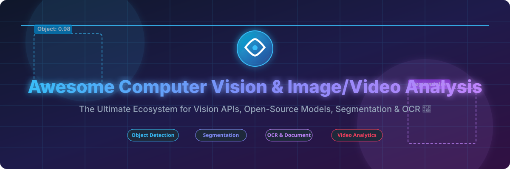

# Awesome-Computer-Vision-Image-Video-Analysis 👁️ 🎥

  

  
  
  
  
  
  

---

## 🌟 Top Computer Vision & Image/Video Analysis Ecosystem 🧠 🔍

**Curated Directory of Enterprise Vision Cloud APIs & Open-Source Computer Vision Frameworks** 🚀  

*Comprehensive guide covering Object Detection, Image Segmentation, OCR & Document AI, Video Analytics, Pose Estimation, Vision-Language Models (VLMs), and Self-Hosted Vision Models.* ⚡

**Last updated: October 2026** 📅

---

### 📌 Overview & Market Insights 📊

Welcome to the definitive curated directory of **computer vision platforms**, **open-source image and video analysis libraries**, and **foundation vision models**. Whether you are looking for enterprise-grade commercial cloud APIs (such as *Amazon Rekognition*, *Google Cloud Vision*, and *Azure AI Vision*), or self-hostable open-source frameworks (like *Ultralytics YOLO*, *OpenCV*, *Segment Anything (SAM)*, and *Hugging Face Transformers*), this collection provides detailed performance metrics, GitHub star rankings, commercial pricing, and free tier limits for developers and AI researchers. 👁️

#### 📈 Market Size & Industry Dynamics 💰
The global Computer Vision market size is estimated at **$22.3 Billion in 2024** and is projected to reach **$50.9 Billion by 2030**, growing at a CAGR of **14.7%**. The market sector is **moderately fragmented**: hyper-scaler cloud providers (Microsoft Azure, AWS, Google Cloud) dominate general-purpose visual recognition APIs, while specialized commercial MLOps platforms (Roboflow, Landing AI, Clarifai) and agile open-source foundation models (Ultralytics YOLO, Meta SAM) hold critical market share in edge deployment, zero-shot segmentation, and industrial visual inspection. 🏭

**Key Ecosystem Highlights:**
- **OpenCV** remains the **foundational computer vision library**, with **80K+ GitHub stars** and **2,500+ optimized algorithms**. 🛠️
- **Segment Anything Model (SAM 2) by Meta** leads **zero-shot image and video segmentation**, with **50K+ GitHub stars**. 🎨
- **Ultralytics YOLO** dominates **real-time object detection and edge deployments**, with **35K+ GitHub stars**. 🎯

---

## 📑 Table of Contents 📜

- [🏢 SaaS & Commercial Platforms](#-saas--commercial-platforms)
- [🔓 Open-Source GitHub Projects](#-open-source-github-projects)
- [🛠️ How to Contribute](#%EF%B8%8F-how-to-contribute)
- [📊 Star History](#-star-history)
- [🤝 Support & Sponsorship](#-support--sponsorship)
- [⚠️ Disclaimer](#%EF%B8%8F-disclaimer)

---

## 🏢 SaaS & Commercial Platforms 💼

*The commercial computer vision API landscape spans hyperscaler cloud vision services, specialized MLOps data annotation pipelines, and visual search engines. Below is a detailed breakdown sorted by company valuation/market cap (descending).* 💎

| SaaS / Commercial Platform | Company / Owner | Valuation / Market Cap 📈 | Standard Edition Starting Price 💵 | Free Tier / Free Trial Limits 🎁 | Description 📝 |
| :--- | :--- | :--- | :--- | :--- | :--- |
| **[Azure AI Vision](https://azure.microsoft.com/en-us/products/ai-services/ai-vision)** 🔷 | Microsoft | **~$3.90 Trillion** | **$1.00 per 1,000 transactions** | **5,000 transactions/month free** | **Azure-native vision API** — Image analysis, OCR, face detection, spatial analysis, Custom Vision classification, and Video Indexer. 🔮 |
| **[Amazon Rekognition](https://aws.amazon.com/rekognition/)** ☁️ | Amazon | **~$2.00 Trillion** | **$1.00 per 1,000 images** (labels); **$0.10/min** (video) | **5,000 images/month for 12 months** | **AWS-native vision API** — Object/scene detection, facial analysis, text detection, content moderation, celebrity recognition, and Custom Labels. 📦 |
| **[Google Cloud Vision API](https://cloud.google.com/vision)** 🌐 | Google (Alphabet) | **~$2.00 Trillion** | **$1.50 per 1,000 images** (labels & OCR) | **1,000 units/month free** | **GCP-native vision API** — Label detection, OCR, face detection, explicit content filtering, Vision Product Search, and Document AI. 🔎 |
| **[Cloudinary AI](https://cloudinary.com/)** ☁️ | Cloudinary | **~$1.00 Billion** | **$89.00/month** (Plus plan) | **25 credits/month free** (~25,000 transformations or 25 GB storage) | **Media optimization with AI** — Auto-tagging, content moderation, visual search, background removal, and generative AI editing. 🖼️ |
| **[Clarifai](https://www.clarifai.com/)** 🎨 | Clarifai | **~$500 Million** | **$30.00/month** (Essential plan) | **1,000 operations/month free** | **Full-stack AI platform** — Image, video, and text recognition, custom model training with no-code tools, and edge/on-premise deployment. 🤖 |
| **[Roboflow](https://roboflow.com/)** 🤖 | Roboflow | **~$200 Million** | **$249.00/month** (Starter plan) | **1,000 credits/month free** | **Computer vision MLOps platform** — Dataset labeling, augmentation, model training, and edge deployment for YOLO and foundation models. 🎯 |
| **[Landing AI](https://landing.ai/)** 🛬 | Landing AI | **~$150 Million** | **$300.00/month** (Pro plan) | **1,000 free credits upon signup** | **Visual inspection AI** — Defect detection for manufacturing, landingLens data-centric AI approach with small datasets. Founded by Andrew Ng. 🏭 |
| **[SuperAnnotate](https://www.superannotate.com/)** ✏️ | SuperAnnotate | **~$100 Million** | **$150.00/month** (Team plan) | **14-day free trial** (up to 500 annotations) | **Data annotation platform** — AI-assisted image, video, and text annotation for training enterprise computer vision models. 🖊️ |
| **[Hive AI](https://thehive.ai/)** 🐝 | Hive | **~$100 Million** | **$0.0015 per API call** ($1.50 per 1,000 calls) | **14-day free trial** ($100 free credit) | **AI content moderation** — Image, video, and text moderation for NSFW, violence, hate speech, and deepfake detection used by social platforms. 🛡️ |
| **[Nyris](https://nyris.io/)** 🔍 | Nyris | **~$30 Million** | **$490.00/month** (Starter plan) | **14-day free trial** (up to 2,500 visual searches) | **Visual search and product recognition** — High-speed visual search engine for industrial spare parts, e-commerce, and suite recognition. ⚡ |

---

## 🔓 Open-Source GitHub Projects 🌾

*Sorted by GitHub Star Count (Descending)* 🌟

- **[Transformers (Hugging Face)](https://github.com/huggingface/transformers)**   
  **State-of-the-art ML for vision, text, and audio**, Apache-2.0 licensed. **130K+ GitHub stars** — **the de facto standard for Vision Transformers (ViT), DETR, CLIP, and VLMs**. Unified API for training and inference across PyTorch and TensorFlow. 🤗

- **[OpenCV](https://github.com/opencv/opencv)**   
  **The foundational open-source computer vision library**, Apache-2.0 licensed. **80K+ GitHub stars** — **the most widely used CV library globally**. 2,500+ optimized algorithms for image processing, object detection, face recognition, and matrix operations across C++, Python, Java, and Android/iOS. 👁️

- **[Tesseract OCR](https://github.com/tesseract-ocr/tesseract)**   
  **Open-source OCR engine**, Apache-2.0 licensed. **58K+ GitHub stars** — **100+ language support with LSTM neural network recognition**. Originally developed by HP, now maintained by Google. 📄

- **[Segment Anything (SAM)](https://github.com/facebookresearch/segment-anything)**   
  **Foundation model for image and video segmentation**, Apache-2.0 licensed. **50K+ GitHub stars** — **zero-shot segmentation from points, boxes, or text prompts**. SAM 2 extends promptable segmentation to video streams in real-time. 🎨

- **[PaddleOCR](https://github.com/PaddlePaddle/PaddleOCR)**   
  **Awesome multilingual OCR toolkit**, Apache-2.0 licensed. **42K+ GitHub stars** — **80+ languages supported with ultra-lightweight PP-OCRv4 models**. Includes text detection, recognition, layout analysis, and document parsing for mobile and server. 📝

- **[Ultralytics YOLO](https://github.com/ultralytics/ultralytics)**   
  **State-of-the-art object detection and segmentation**, AGPL-3.0 licensed. **36K+ GitHub stars** — **dominant real-time vision framework featuring YOLOv8 and YOLO11**. Built for object detection, instance segmentation, pose estimation, and object tracking on CPU, GPU, and edge. 🎯

- **[MediaPipe (Google)](https://github.com/google/mediapipe)**   
  **Cross-platform ML pipeline framework**, Apache-2.0 licensed. **27K+ GitHub stars** — **real-time face mesh, hand tracking, pose estimation, and object detection**. Lightweight and battle-tested in Google Meet and YouTube. 🖐️

- **[MMDetection](https://github.com/open-mmlab/mmdetection)**   
  **OpenMMLab detection toolbox**, Apache-2.0 licensed. **27K+ GitHub stars** — **modular framework with 100+ object detection algorithms**. Features Faster R-CNN, Mask R-CNN, RetinaNet, Deformable DETR, and YOLO modules. 🔧

- **[Detectron2 (Meta)](https://github.com/facebookresearch/detectron2)**   
  **Object detection and panoptic segmentation library**, Apache-2.0 licensed. **26K+ GitHub stars** — **next-gen research platform powered by PyTorch**. Supports object detection, instance segmentation, keypoint detection, and panoptic segmentation. 🏛️

- **[Albumentations](https://github.com/albumentations-team/albumentations)**   
  **Fast and flexible image augmentation library**, MIT licensed. **14K+ GitHub stars** — **70+ image augmentation transforms**. Optimized for performance and widely integrated into PyTorch, TensorFlow, and YOLO pipelines. 🎨

- **[DeepFace](https://github.com/serengil/deepface)**   
  **Face recognition and facial attribute analysis framework**, MIT licensed. **13K+ GitHub stars** — **lightweight face recognition framework wrapping VGG-Face, Google FaceNet, OpenFace, DeepID, ArcFace, and SwinFace**. Includes age, gender, emotion, and race estimation. 😊

- **[FiftyOne](https://github.com/voxel51/fiftyone)**   
  **Open-source dataset curation and model visualization**, Apache-2.0 licensed. **8.5K+ GitHub stars** — **visualize computer vision datasets, evaluate model predictions, and filter annotations**. Compatible with PyTorch, TensorFlow, and YOLO. 📊

- **[Supervision (Roboflow)](https://github.com/roboflow/supervision)**   
  **Reusable computer vision utilities**, MIT licensed. **23K+ GitHub stars** — **annotators, zone counters, object trackers (ByteTrack), and evaluation metrics**. Simplifies computer vision application development. 👁️

- **[DeepStream SDK Tools / DeepStream Python (NVIDIA)](https://github.com/NVIDIA-AI-IOT/deepstream_python_apps)**   
  **Multi-sensor processing and video analytics framework**, Apache-2.0 licensed. **4.5K+ GitHub stars** — **high-performance streaming video analytics SDK powered by TensorRT and CUDA**. Real-time object tracking and AI pipeline deployment for NVIDIA GPUs and Jetson edge devices. ⚡

- **[EasyOCR](https://github.com/JaidedAI/EasyOCR)**   
  **Ready-to-use OCR with 80+ supported languages**, Apache-2.0 licensed. **24K+ GitHub stars** — **Python OCR module powered by PyTorch (CRAFT text detection and ResNet/LSTM recognition)**. Extremely easy to integrate. 📖

---

## 🛠️ How to Contribute 🤝

Contributions are welcome! Follow these steps to submit new computer vision platforms, vision foundation models, or open-source software: 🚀

1. 🍴 **Fork** the repository.
2. 📝 **Add/edit** entries in `README.md` maintaining table/list structure and formatting.
3. 🔗 Include project title, official website/GitHub link, exact Stars Count, license, and concise description.
4. 🚀 Submit a **Pull Request** with a descriptive summary of your changes.

---

## 📊 Star History 📈

---

## 🤝 Support & Sponsorship 💖

If you find this computer vision and video analysis repository useful, please consider supporting the project:

- ⭐ **Star** this repository to increase visibility!
- 🔀 **Fork** and share with fellow AI engineers, computer vision researchers, and open-source advocates.
- ☕ **Buy Me a Coffee / Sponsor**: Support ongoing open-source curation via the [GitHub Sponsor Dashboard](https://github.com/sponsors/ishandutta2007).

---

## ⚠️ Disclaimer ℹ️

- This is a **community-curated** list — not exhaustive and not an explicit endorsement. ℹ️
- **Cloud Vision APIs charge per image or transaction** — **$1.00–$1.50 per 1,000 images** for label detection. **Video analysis adds ~$0.10/minute**. Always model your visual data volume before committing. 💡
- **Open-source vision tools (OpenCV, YOLO, SAM, Transformers) require technical setup** — including **GPU compute resources, Python/C++ skills, and dataset annotation**. Always benchmark model latency and accuracy on your domain data prior to production deployment. 👁️

---

  <b>Made with ❤️ for AI engineers, computer vision researchers, and open-source vision advocates.</b>

